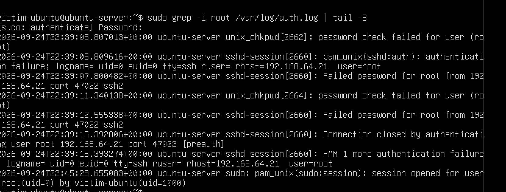
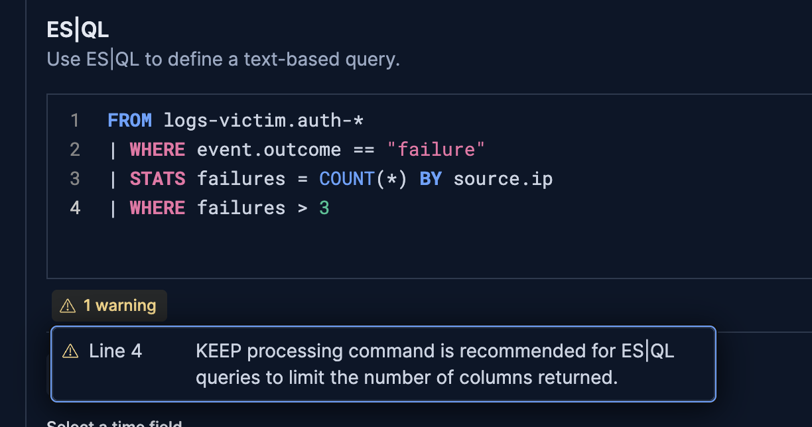
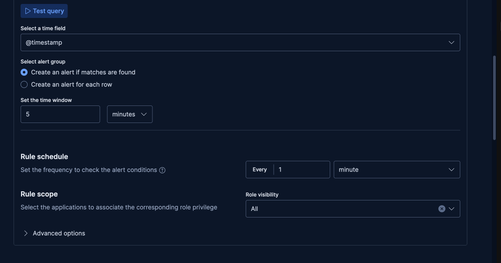
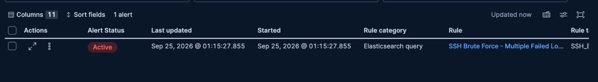
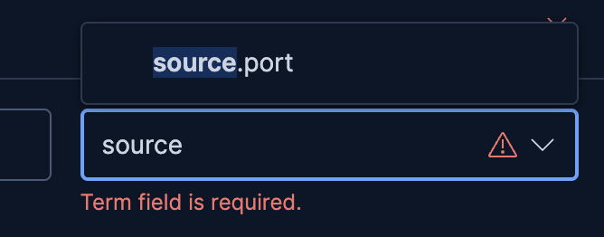
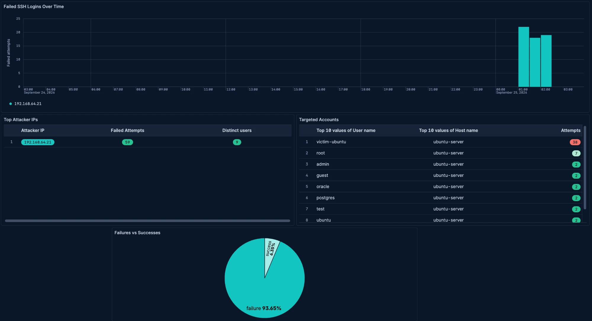
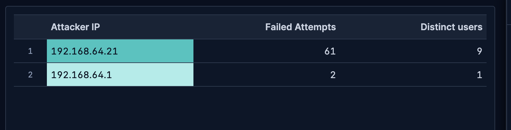
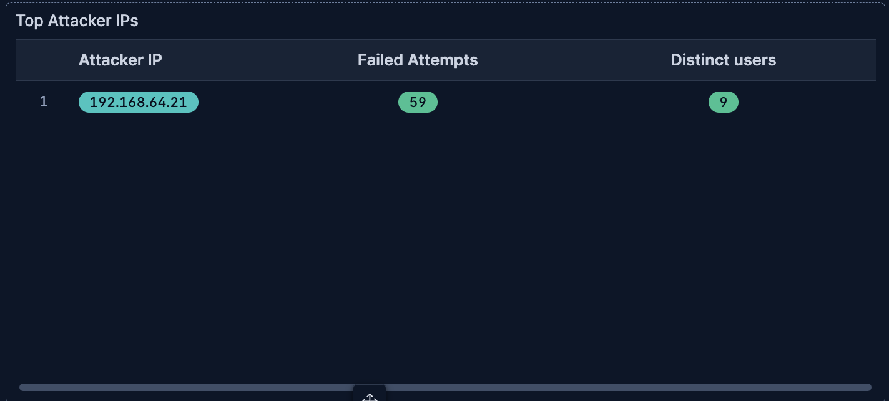

# Home SOC Lab: Detecting SSH Attacks with the Elastic Stack

A hands-on Security Operations Center (SOC) lab, built end to end with free tools on a Mac (Apple Silicon): a simulated attack against an Ubuntu server, log collection into the Elastic Stack, six custom detection rules mapped to MITRE ATT&CK, a monitoring dashboard, and automatically generated incident reports (a technical report and a management briefing).

> This lab was run entirely against infrastructure I own, on an isolated virtual network created for this purpose. The "attacker" is my own Kali Linux VM and the "victim" is my own Ubuntu VM. Nothing here targets a system I don't control.

## Overview

```
Isolated UTM network on a Mac: Kali (attacker), Ubuntu Server (victim), Docker on the host
  |
  Victim writes SSH / sudo / account events to /var/log/auth.log
  |
  Elastic Agent ships the log lines to Elasticsearch (running in Docker on the Mac)
  |
  An ingest pipeline (grok) parses each SSH line into fields: source.ip, user.name, event.outcome
  |
  From Kali: port scan, brute force, password spraying, root login attempts
  On the victim: create a user, grant it sudo (the "attacker is already in" steps)
  |
  Six ES|QL rules in Kibana turn those patterns into alerts, each mapped to a MITRE ATT&CK technique
  |
  A Kibana dashboard shows the attack at a glance
  |
  A Python script queries Elasticsearch and writes the incident reports
```

## Table of Contents

- [Goals](#goals)
- [Environment](#environment)
- [Background: How the Pieces Fit Together](#background-how-the-pieces-fit-together)
- [Part 1 - The Network and the Virtual Machines](#part-1---the-network-and-the-virtual-machines)
- [Part 2 - The SIEM in Docker](#part-2---the-siem-in-docker)
- [Part 3 - Shipping Logs with Elastic Agent](#part-3---shipping-logs-with-elastic-agent)
- [Part 4 - Parsing the Logs](#part-4---parsing-the-logs)
- [Part 5 - Simulating the Attack](#part-5---simulating-the-attack)
- [Part 6 - Detection Rules](#part-6---detection-rules)
- [Part 7 - The Dashboard](#part-7---the-dashboard)
- [Part 8 - Automated Incident Reports](#part-8---automated-incident-reports)
- [Results](#results)
- [Problems I Ran Into](#problems-i-ran-into)
- [Extending This Lab](#extending-this-lab)
- [What's Next](#whats-next)
- [Repo Contents](#repo-contents)
- [Tooling Reference](#tooling-reference)

## Goals

- Build a working SIEM pipeline: log source, shipper, parsing, storage, detection, dashboard.
- Write detection rules against real attack traffic and confirm each one fires, rather than trusting a rule I never tested.
- Map every detection to MITRE ATT&CK, covering credential access, initial access, persistence and privilege escalation.
- Automate the reporting step the way a SOC analyst would: one technical report with evidence, and one short briefing for management.
- Document the problems honestly, including the ones that took time to diagnose.

## Environment

| Component | Choice |
|---|---|
| Host machine | MacBook (Apple Silicon, M1) |
| Hypervisor | UTM, shared network `192.168.64.0/24` |
| Attacker | Kali Linux VM, `192.168.64.21` (`nmap`, `hydra`) |
| Victim | Ubuntu Server 26.04 LTS (arm64) VM, `192.168.64.25`, OpenSSH 10.2 |
| Log shipper | Elastic Agent 9.5.4, standalone mode (no Fleet) |
| SIEM | Elasticsearch + Kibana 9.5.4 in Docker on the Mac (`192.168.64.1` from the VMs) |
| Reporting | Python 3 + `requests` |

Everything is free and runs locally. The SIEM runs in Docker on the host rather than in a third VM, which keeps memory use low on an 8-16 GB machine.

---

## Background: How the Pieces Fit Together

Skip this section if you already know SIEM basics. It is here so the rest of the write-up makes sense on its own, and so none of the jargon below shows up unexplained later.

**What is a SIEM, really?** The word sounds bigger than the idea. A SIEM (Security Information and Event Management) is just a system that collects activity logs from your machines in one place, lets you search them, and can automatically flag patterns that look suspicious. It's the security-camera-footage equivalent for computers: constant recording, plus something watching the recording for you.

### The log pipeline

A SIEM is really a chain of small, simple steps:

1. **Log source.** The victim machine's `/var/log/auth.log` is a plain text file where Linux already writes every SSH login attempt, `sudo` command, and account change - no extra setup needed, it happens by default.
2. **Shipper.** A small background program, **Elastic Agent**, watches that file and forwards each new line over the network to the SIEM.
3. **Parsing.** A raw log line is just a sentence of text. Before it's useful, it needs to be broken into labeled pieces - who tried to log in, from which IP, did it succeed. That's what an **ingest pipeline** does.
4. **Storage.** **Elasticsearch** (the database half of the stack) stores the parsed events so they can be searched instantly, even if there are millions of them.
5. **Detection.** Rules run automatically on a timer, asking simple yes/no questions like "did the same IP fail more than 3 times in the last 5 minutes?" - and raise an alert when the answer is yes.
6. **Visualization.** **Kibana** (the web interface half of the stack) is where a human actually looks at the data, searches it, and reviews alerts.

### Why parsed fields matter

If all you have is the raw sentence `Failed password for root from 1.2.3.4`, you can search for the word "Failed", but you can't easily ask "how many different IPs did this?" or "list every failed attempt, grouped by attacker." Once the line is broken into fields (`user.name: root`, `source.ip: 1.2.3.4`, `event.outcome: failure`), those questions become one-line queries. Every rule in this project depends on that breakdown existing first, which is why getting the parsing right (Part 4) came before writing a single rule.

### A quick glossary of the tools used here

- **Elasticsearch** - stores and searches the log data. Think "a database built specifically for fast searching."
- **Kibana** - the website you click around in: search logs (Discover), build charts (Dashboards), and manage alert rules (Rules).
- **Elastic Agent** - the small program installed on a machine to collect and forward its logs.
- **Ingest pipeline** - the step that turns one raw log line into labeled fields (see above).
- **ES|QL** - the query language used to write every detection rule here. It reads almost like a short recipe: "take this data, keep only the failures, count them per IP, keep only the counts above 3."
- **ECS (Elastic Common Schema)** - a shared naming convention for fields, so an IP address is always called `source.ip` everywhere, never `srcip` in one place and `attacker_ip` in another. It's what makes rules and dashboards easy to reuse.

### MITRE ATT&CK, in one paragraph

MITRE ATT&CK is a free, public catalog of attacker techniques, each with a short ID like `T1110.001`. Instead of writing "someone tried a lot of passwords" in a report, a security team writes "T1110.001 - Password Guessing," and anyone in the industry immediately knows exactly what that means without further explanation. Every rule in this project is labeled with the technique it's meant to catch.

---

## Part 1 - The Network and the Virtual Machines

All VMs use UTM's **Shared Network** mode, so they get addresses from one private subnet and can also reach the Mac host, which is the default gateway (`192.168.64.1`). That last detail matters: it is how the victim later reaches Elasticsearch on the host.

Verification from Kali:

```bash
ip a                     # eth0: 192.168.64.21/24
ip route | grep default  # default via 192.168.64.1
```

The victim is Ubuntu Server (arm64) with 2 GB RAM and 2 CPU cores. During installation I selected **OpenSSH server**, then confirmed that Kali could log in and that the login appeared in the log:

```
sshd-session[1952]: Accepted password for victim-ubuntu from 192.168.64.21 port 37732 ssh2
```

`auditd` was also installed on the victim for richer host logging.

## Part 2 - The SIEM in Docker

Elasticsearch and Kibana run as two containers defined in `docker-compose.yml`. The official images are multi-architecture, so they run natively on Apple Silicon.

Design choices:

- **Security disabled** (`xpack.security.enabled=false`) - normally Elasticsearch requires a username and password for every request; this turns that off to keep the lab simple. It has one real consequence for detection rules, covered in [Part 6](#part-6---detection-rules).
- **Single node** (`discovery.type=single-node`) with 1 GB of memory reserved for it - Elasticsearch is usually spread across several machines ("nodes") for redundancy, but a lab only needs one, and 1 GB is plenty for this amount of data.
- **Kibana encryption key** supplied through a local `.env` file that is git-ignored (never uploaded). Kibana needs a setting called `xpack.encryptedSavedObjects.encryptionKey` to safely store the credentials that alert rules use to run themselves in the background. Copy `.env.example` to `.env` and set your own key with `openssl rand -hex 32`.

```bash
docker compose up -d
curl localhost:9200      # returns the cluster info as JSON
# open http://localhost:5601
```

## Part 3 - Shipping Logs with Elastic Agent

Elastic Agent runs on the victim in **standalone** mode - meaning it's configured with a plain settings file instead of being centrally managed by a "Fleet Server" (Elastic's dashboard for controlling many agents at once, which needs security turned on to work). Standalone mode skips that entirely. The config in `config/elastic-agent.yml` points the output at the Mac host and the input at `auth.log`:

```yaml
outputs:
  default:
    type: elasticsearch
    hosts: ["http://192.168.64.1:9200"]
inputs:
  - id: victim-auth-logs
    type: filestream
    streams:
      - id: victim-auth-log-stream
        data_stream:
          dataset: victim.auth
        paths:
          - /var/log/auth.log
```

After installing (`sudo ./elastic-agent install --config elastic-agent.yml`), `sudo elastic-agent status` reports `HEALTHY`, and the events appear in Kibana Discover under `data_stream.dataset : "victim.auth"`. The line `Fleet: Not enrolled` is expected in standalone mode.

## Part 4 - Parsing the Logs

The events first arrived as raw text only. I wrote an ingest pipeline (`elasticsearch/ingest-pipeline.json`) with a `grok` processor for the SSH lines - grok is basically a template for text, similar to a regular expression, but built to name the pieces it captures (`%{IP:source.ip}` means "grab an IP address here and call it `source.ip`") - plus two small scripts that set `event.outcome` from the action (`Accepted` becomes `success`, `Failed` becomes `failure`).

I tested it with the `_simulate` API before connecting it to anything, using both an accepted and a failed line, and both parsed correctly. The pipeline itself was never the problem.

**Making it actually run took a detour.** Setting a `pipeline:` key in the agent config, either on the input or on the output, was accepted without any error but had no effect. The fix was to attach the pipeline on the Elasticsearch side with an index template (`index.default_pipeline`), then force a rollover so the existing data stream picked it up. The full write-up is in [troubleshooting-pipeline.md](troubleshooting-pipeline.md).

Result on a fresh SSH login:

```
event.action: Accepted   event.outcome: success
source.ip: 192.168.64.21  user.name: victim-ubuntu
```

## Part 5 - Simulating the Attack

Each rule was written and then tested against a matching attack. The victim account deliberately had a weak password.

| Step | Command | ATT&CK technique |
|---|---|---|
| Service discovery | `nmap -sV 192.168.64.25` (finds SSH on port 22, OpenSSH 10.2) | T1046 |
| Brute force | `hydra -l victim-ubuntu -P wrong.txt ssh://192.168.64.25 -t 4` | T1110.001 |
| Brute force, then success | `hydra` with the valid password last in the list, `-t 1` | T1110 / T1078 |
| Password spraying | `hydra -L users.txt -p wrongpass ssh://192.168.64.25 -t 4` | T1110.003 |
| Root login attempt | `ssh root@192.168.64.25` with a wrong password | T1078.003 |
| New account (on the victim) | `sudo useradd hacker` | T1136.001 |
| Privilege escalation (on the victim) | `sudo usermod -aG sudo hacker2` | T1098 |

The `nmap` scan is not detected by any rule, because `auth.log` does not record network scans. See [What's Next](#whats-next).

The raw log for the root attempts, showing the line format the detection depends on:



## Part 6 - Detection Rules

Six rules, all of type **Elasticsearch query (ES|QL)**, checked every minute over a 5-minute window, with one alert per result row. The full queries and test commands are in [detection-rules/README.md](detection-rules/README.md).

| # | Rule | Logic | ATT&CK |
|---|---|---|---|
| 1 | SSH Brute Force | More than 3 failures from one IP | T1110.001 |
| 2 | Successful Login After Brute Force | Same IP has more than 3 failures and at least one success | T1110 / T1078 |
| 3 | Password Spraying | More than 3 distinct usernames from one IP | T1110.003 |
| 4 | Root Login Attempt | Any SSH attempt for `root` | T1078.003 |
| 5 | New Local User Created | `useradd` line in `auth.log` | T1136.001 |
| 6 | User Added to Sudo Group | `usermod` adds a user to `sudo` | T1098 |

The rule from #1 as written:

```
FROM logs-victim.auth-*
| WHERE event.outcome == "failure"
| STATS failures = COUNT(*) BY source.ip
| WHERE failures > 3
| KEEP source.ip, failures
```




After a `hydra` run, the alert appears as **Active** for the attacker's IP:



### Why generic Stack rules and not the Security detection engine

Kibana's Security app has a dedicated detection engine with a built-in ATT&CK field. Opening it returned "Detection engine permissions required" and, in the Kibana log, `No authorization filter defined`. In plain terms: that engine needs to know *who* is running each rule, which means user accounts and logins have to exist - it requires `xpack.security` to be enabled, and this lab runs with it disabled to stay simple. I used the generic alerting framework instead (the same one behind every rule in this project) and recorded the technique ID by hand in each rule's name and tags.

### Why ES|QL and not the Index Threshold rule

I first tried the simpler **Index Threshold** rule type. Its "group by" field list does not offer `source.ip`, because that field is of type `ip`, and only `source.port` is listed. ES|QL handles `ip` fields and lets one query group by several fields, so I switched.



## Part 7 - The Dashboard

The dashboard "SSH Attack Overview" has four panels built in Lens on a `logs-victim.auth-*` data view:

- **Failed SSH Logins Over Time:** stacked bars by `source.ip`.
- **Top Attacker IPs:** failed attempts and distinct usernames per source IP.
- **Failures vs Successes:** share of outcomes.
- **Targeted Accounts:** which user and host were attacked, and how often.



**A bug I caught by validating against a second source.** The first version of the "Top Attacker IPs" table showed the Mac (`192.168.64.1`) as having 2 failed attempts and the attacker as having 61. When I generated a report with a script that queried Elasticsearch directly, it showed 59 failures for the attacker and none for the Mac. The dashboard panel was missing the `event.outcome : "failure"` filter, so it counted successful logins as "attempts". The Mac's two entries were my own legitimate logins.




The lesson: a dashboard can look convincing and still be wrong. I now check panels against an independent query before trusting them.

## Part 8 - Automated Incident Reports

`scripts/report.py` queries Elasticsearch directly (the log data stream for failures and successes, and Kibana's alert index for the alerts that actually fired) and writes two files:

- `incident-technical.md`: failed logins by source IP, successful logins, alerts grouped by rule with first and last time, and per-rule recommendations. Two sections are left for the analyst to write.
- `incident-executive.md`: a one-page management briefing. It states what happened in plain language, computes a severity, gives the time from the first suspicious attempt to the first alert, and lists prioritized actions written for a non-technical reader.

```bash
python3 scripts/report.py --date 2026-09-24        # times in UTC by default
python3 scripts/report.py --start "2026-09-24 20:00" --end "2026-09-25 02:00" --tz Asia/Jerusalem
```

Recommendations come from two dictionaries in the script: technical playbooks (investigate, contain, prevent) for the technical report, and a shorter plain-language list for the briefing. The severity is a simple rule: high if the attacker's IP had a successful login. The output for this lab is in [incident-reports/2026-09-24-ssh-compromise/](incident-reports/2026-09-24-ssh-compromise/).

---

## Results

What the simulated incident produced, from the generated report (UTC):

| Time | Event | Rule that fired |
|---|---|---|
| 22:14 | First failed login from the attacker | |
| 22:15 | Brute force detected (about 1 minute later) | SSH Brute Force |
| 22:31 | Attacker logs in successfully | Successful Login After Brute Force |
| 22:35 | Many usernames tried from one IP | Password Spraying |
| 22:38 | Attempts against `root` | Root Login Attempt |
| 22:54 | New local user created | New Local User Created |
| 22:59 | User added to the sudo group | User Added to Sudo Group |

- 59 failed logins from one source IP, trying 9 different usernames.
- 15 alerts across all 6 rules. The count is higher than 6 because an alert closes when the 5-minute window passes and opens again if the activity continues.
- Every one of the six rules fired against its matching attack.
- The management briefing rated the incident **HIGH**: a login by the attacker followed by account and privilege changes.

## Problems I Ran Into

| Problem | Cause | Fix |
|---|---|---|
| Parsed fields never appeared | `pipeline:` in the agent config is silently ignored in standalone mode | Attach the pipeline in Elasticsearch with an index template, then roll over the data stream |
| Detection engine "permissions required" | The Security detection engine needs `xpack.security` enabled | Use generic Stack rules (ES\|QL) and put the ATT&CK ID in the name and tags |
| Kibana "missing encryption key" | Alerting needs `xpack.encryptedSavedObjects.encryptionKey` | Set it through an ignored `.env` file |
| Index Threshold could not group by attacker IP | The `ip` field type is not offered for grouping | Switch to ES\|QL rules |
| Recent events "missing" in Kibana | The victim VM's clock had drifted about 16 minutes after being paused | Set the clock manually; check `date -u` on both machines |
| Confusing times | Kibana shows the browser's time zone (UTC+3) while raw documents are UTC | Use UTC everywhere in reports |
| A dashboard panel double-counted | Missing failure filter | Validated against a direct query and fixed |

## Extending This Lab

The six rules here are not the ceiling, they're a template. Every one of them follows the same shape, and adding a new one is a matter of answering one question - "what pattern, counted over what field, should trigger this?" - and then repeating three steps:

1. **Write the pattern as an ES|QL query**, following the same shape as the existing rules: `FROM logs-victim.auth-* | WHERE ... | STATS ... BY ... | WHERE <threshold> | KEEP ...`.
2. **Create it in Kibana**: Stack Management → Rules → Create rule → Elasticsearch query → ES|QL, with the same schedule as the others (5-minute window, checked every minute, one alert per row).
3. **Add it to `scripts/report.py`**: one entry in the `PLAYBOOKS` dict (technical investigate/contain/prevent steps) and one in `EXEC_ACTIONS` (the plain-language version), keyed by the start of the rule's name. New rules then get recommendations in the generated reports automatically, with no other code changes.

A few concrete ideas for rules to add next, roughly in order of how easy they'd be to write against the data already being collected:

- **Off-hours logins** - a successful login outside normal working hours, which is often more suspicious than the login itself.
- **Reverse spraying / credential stuffing** - one username getting failed attempts from many *different* source IPs in a short window (the mirror image of Rule 3, which looks at many usernames from one IP).
- **Unknown host appears** - an event from a `host.name` that has never been seen before, which could mean a new, unmanaged machine joined the network.
- **Sudden volume spike** - an unusually high count of *any* event type in a short window, which can indicate a scripted attack or a flood/denial-of-service attempt rather than a slow manual one.
- **Rare command in a sudo session** - flag specific dangerous commands (e.g. `chmod 777`, `curl | bash`) appearing in `auth.log`'s sudo entries.

## What's Next

- **Network detection.** Add Suricata to catch port scans and other network-level activity that `auth.log` cannot show.
- **Enable Elastic security.** Turn on `xpack.security` (users, roles) so the native detection engine, with its built-in ATT&CK mapping, can be used.
- **More log sources.** Web server logs, Windows event logs.
- **Case management.** Send alerts to TheHive or a similar tool.
- **Threat intelligence enrichment.** Look up attacker IPs against public reputation APIs.
- **Response.** Test blocking the attacker automatically with `fail2ban`.

## Repo Contents

| Path | Purpose |
|---|---|
| `docker-compose.yml`, `.env.example` | Elasticsearch and Kibana (copy `.env.example` to `.env`) |
| `config/elastic-agent.yml` | Elastic Agent config for the victim VM |
| `elasticsearch/` | Ingest pipeline and index template |
| `detection-rules/` | The six rules with queries, ATT&CK mapping and test commands |
| `scripts/report.py` | Generates the technical report and the management briefing |
| `incident-reports/` | Example generated reports for the simulated incident |
| `troubleshooting-pipeline.md` | The pipeline debugging story in detail |
| `screenshots/` | Evidence used in this README |

## Tooling Reference

```bash
# Start the SIEM
cp .env.example .env            # then set your own key: openssl rand -hex 32
docker compose up -d

# Kibana Dev Tools: create the pipeline and the template, then roll over once
PUT _ingest/pipeline/victim-auth-pipeline            # body: elasticsearch/ingest-pipeline.json
PUT _index_template/victim-auth-template             # body: elasticsearch/index-template.json
POST logs-victim.auth-default/_rollover/

# Victim VM
sudo ./elastic-agent install --config config/elastic-agent.yml
sudo elastic-agent status

# Attacker (Kali)
nmap -sV 192.168.64.25
hydra -l victim-ubuntu -P wrong.txt ssh://192.168.64.25 -t 4
hydra -L users.txt -p wrongpass ssh://192.168.64.25 -t 4

# Reports
python3 scripts/report.py --date 2026-09-24
```
